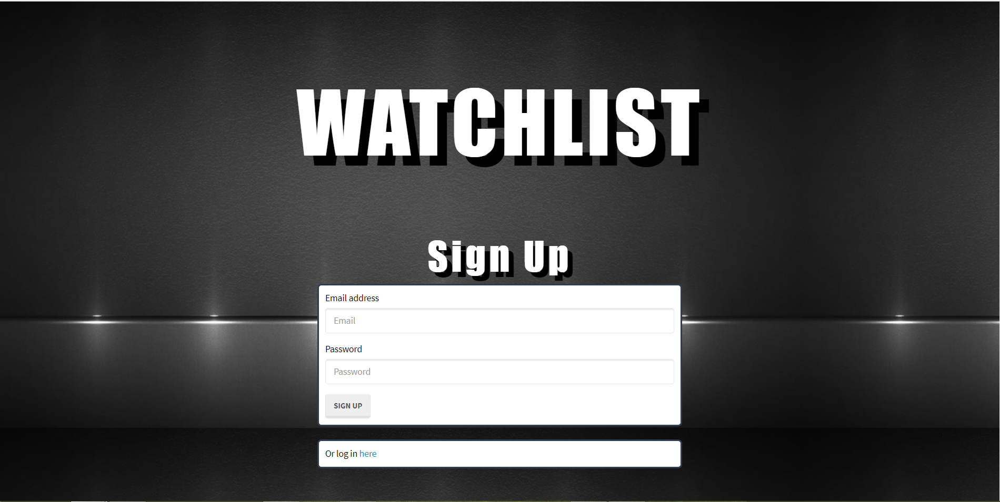
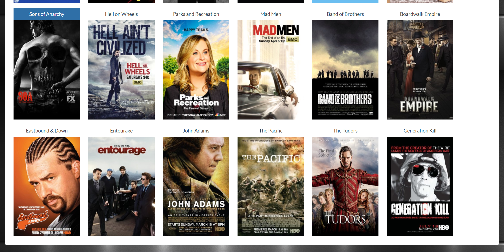

# Watchlist

## Watchlist is a movie/series/video game organizer.

## Users can set their content based on categories and personalized notes.

## Users search for a title, add the one they are looking for, and set catagories like "currently watching" as well as notes. 

## Users have the ability to update and delete content as they please. 

## Utilizes Passport.js, imdb-api npm package, sequelize, MySQL, node.js, and Express along with other support packages.

https://personalwatchlist.herokuapp.com/

log in

sign up

Home Page

Categories

Search for a Series

Search Modal loads top ten best search results on click

When the Add button is clicked the user sets the category and notes

When the user presses submit the show is added to their series watchlist

When the user clicks the poster or title, they can view the show's information, edit, and delete

Edit Options

When the user is done editing, the show is updated

Delete

When the user presses delete, the show is removed
